# Webelive P2P AUDIO VIDEO  
P2P A/V TOOLS

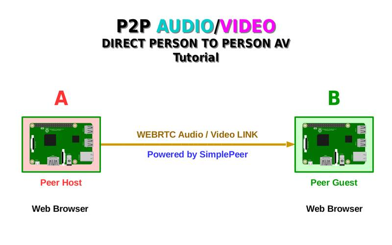
  
---
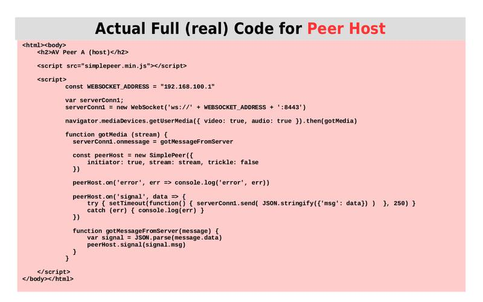
  
---
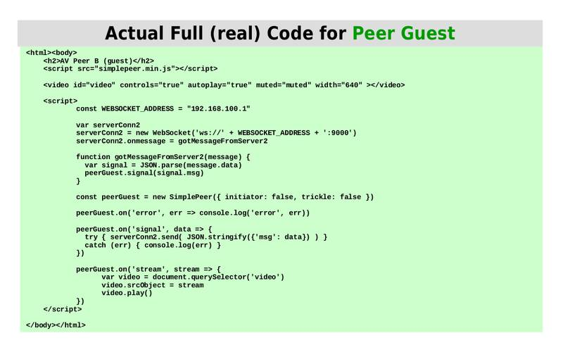
  
---
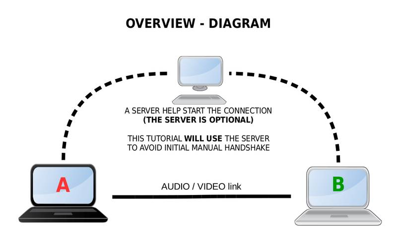
  
---
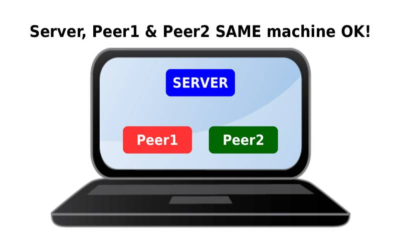
  
---
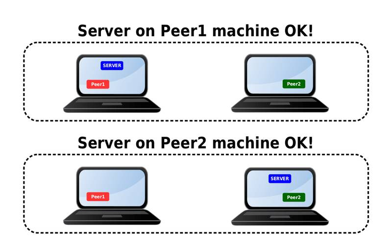
  
---
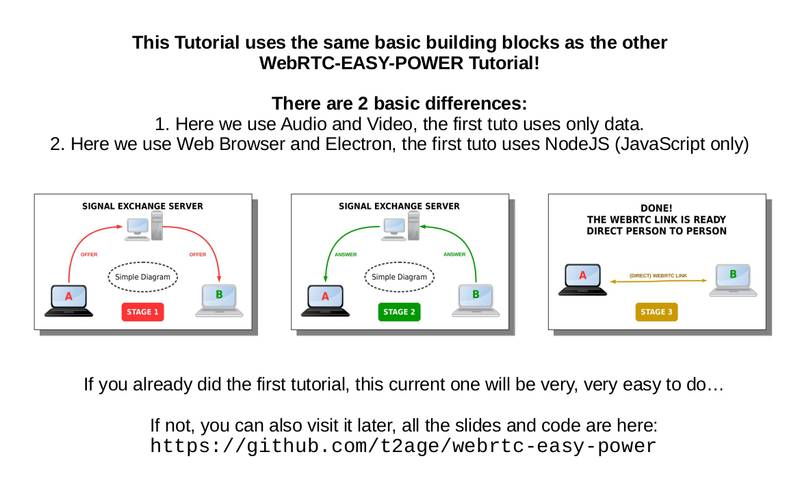
  
---
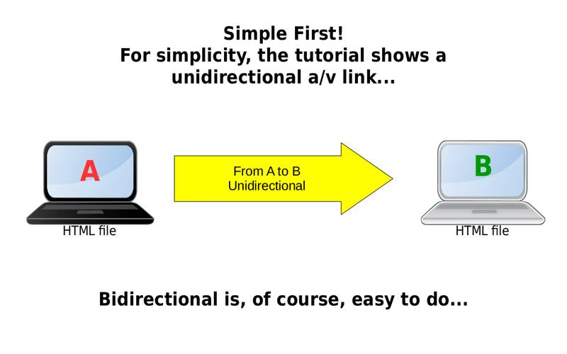
  
---
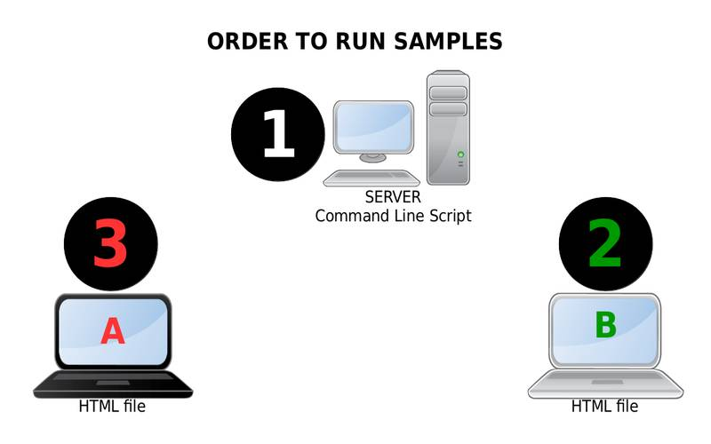
  
---
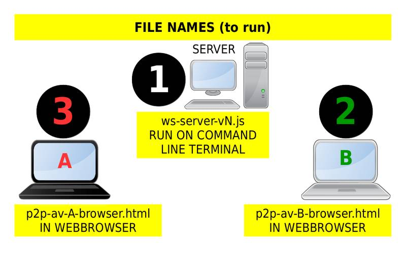
  
---
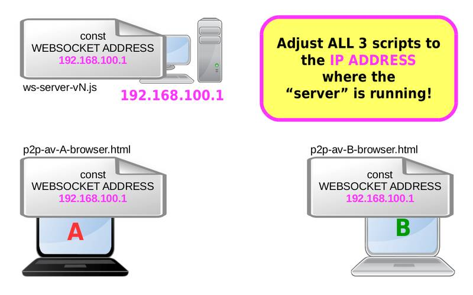
  
---

  
---
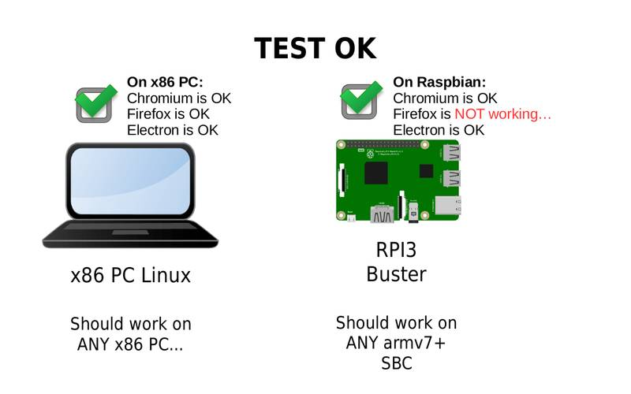

---
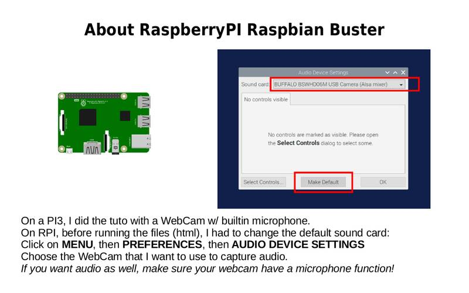
  
---
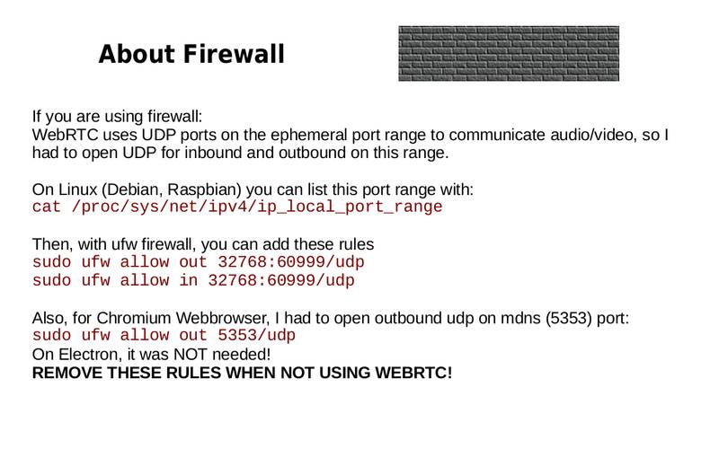
  
---
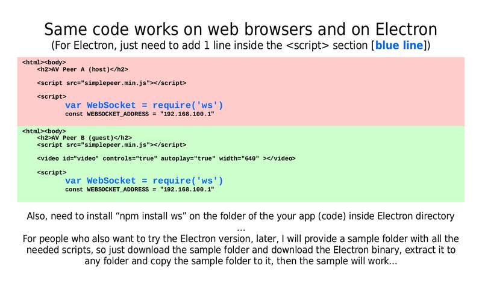
  
---
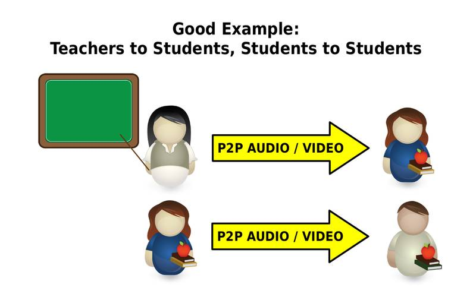
  
---
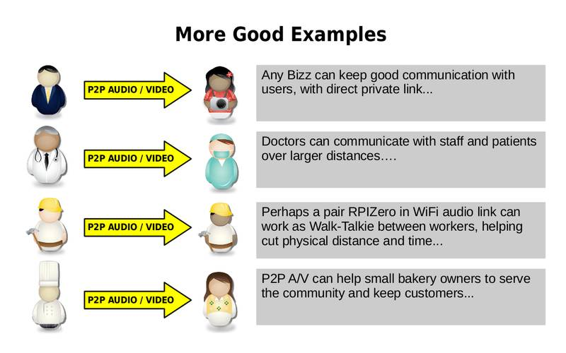  
  
---
  
  
**HOWTO TEXT VERSION**  

https://github.com/t2age/wl-p2p-av/tree/master/tutorial
  
  
.
